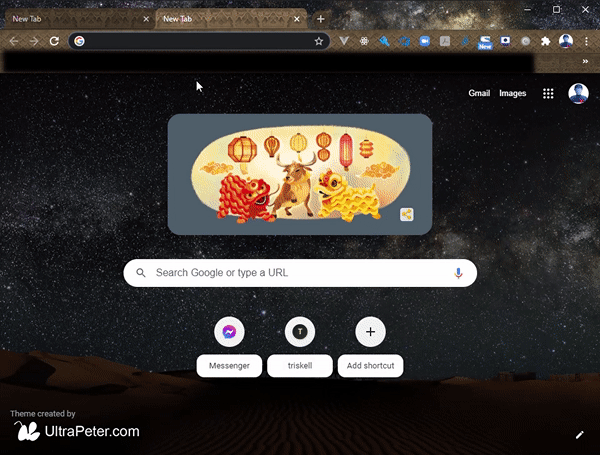
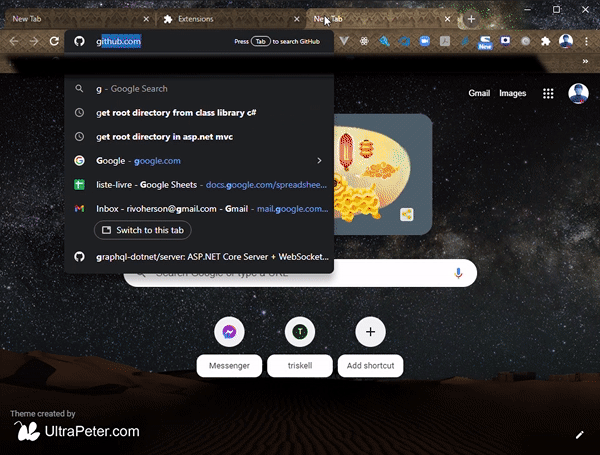

# IDE github1s quick button

This chrome extension allows you to add a quick button access to IDE github1s.

## Quick install

Please follow the steps below to install the extension:

1. Clone the project on local
```
> git clone https://github.com/gasystarttask/add-ide-1s-button.git
```

2. Open chrome browser and visit [chrome://extensions/](chrome://extensions/)

3. Drag the source folder into the window



